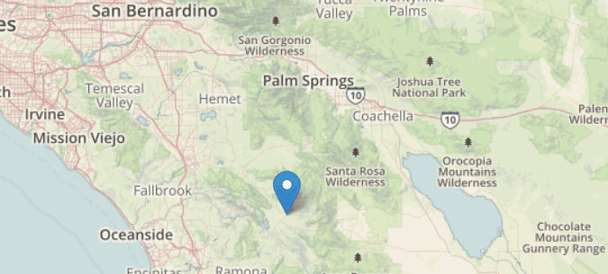

# Leaflet Popup Modifier
A small plugin for leaflet which allows the author to apply removable or editable options to a popup


<p align="center">
  
</p>


## Demo

Check out [this codesandbox](https://codesandbox.io/s/leaflet-popup-modifier-kbuwd) for examples with explanations.


## Installation
Just download the .js and .css files and include them in your project.  The .js file must come after your leaflet
script but before your personal script:

```html
<head>

      <!-- Load Leaflet from CDN -->
      <link rel="stylesheet" href="https://unpkg.com/leaflet@1.5.1/dist/leaflet.css"
      integrity="sha512-xwE/Az9zrjBIphAcBb3F6JVqxf46+CDLwfLMHloNu6KEQCAWi6HcDUbeOfBIptF7tcCzusKFjFw2yuvEpDL9wQ=="
      crossorigin=""/>
      <script src="https://unpkg.com/leaflet@1.5.1/dist/leaflet.js"
      integrity="sha512-GffPMF3RvMeYyc1LWMHtK8EbPv0iNZ8/oTtHPx9/cc2ILxQ+u905qIwdpULaqDkyBKgOaB57QTMg7ztg8Jm2Og=="
      crossorigin=""></script>

      <!-- Leaflet Popup Modifier -->
      <script src="js/popupMod.js" type="text/javascript"></script>
      <link rel="stylesheet" href="css/popupMod.css">

      <!-- Personal style and script file links -->
      <link rel="stylesheet" href="css/style.css">
      <script src="js/script.js" type="text/javascript" defer></script>

</head>
```

## Using the plugin

When creating a popup, you can select options to decide of the popup will be able to remove its source by adding the option.

```javascript
var myMarker =  L.marker( [33.270, -116.650] );
myMarker
   .bindPopup( "Center Marker" , {removable: true} )
   .addTo(leafletMap)
```

You can also choose to make the text within the popup editable:

```javascript
var myMarker =  L.marker( [33.270, -116.650] );
myMarker
   .bindPopup( "Center Marker" , {editable: true} )
   .addTo(leafletMap)
```

Or Both:

```javascript
var myMarker =  L.marker( [33.270, -116.650] );
myMarker
   .bindPopup( "Center Marker" , {removable: true, editable: true} )
   .addTo(leafletMap)
```

You can of course just apply this to a popup without a marker.   However it can not be made removable, as there is no source to remove.

```javascript
var popup = L.popup({editable: true})
    .setLatLng( [33.270, -116.650] )
    .setContent('This is fully editable')
    .openOn(leafletMap);
```

### Using a `nametag`

Removable popups will automatically render their "Remove this {thing}" link with {thing} as the same name as the leaflet element that the popup originates from.  For example, a marker's popup will say "Remove this marker," a polygon's popup will say "Remove this polygon," etc.  The author can change this by specifying `nametag` in the options, like so:

````javascript
var myMarker =  L.marker( [33.270, -116.650], {icon: seaMonster} );
myMarker
   .bindPopup( "Center Marker" , {removable: true, editable: true, nametag: 'Sea Monster'} )
   .addTo(leafletMap)
````

### Capturing the event

Removing a popup's source will trigger a `removeMarker` event on the `document`, which you can capture.  The removed source is available in `event.detail`.

````javascript
document.addEventListener("removeMarker", (e) => {
  console.log(e);
});
````

## License
GNU GENERAL PUBLIC LICENSE Version 3
